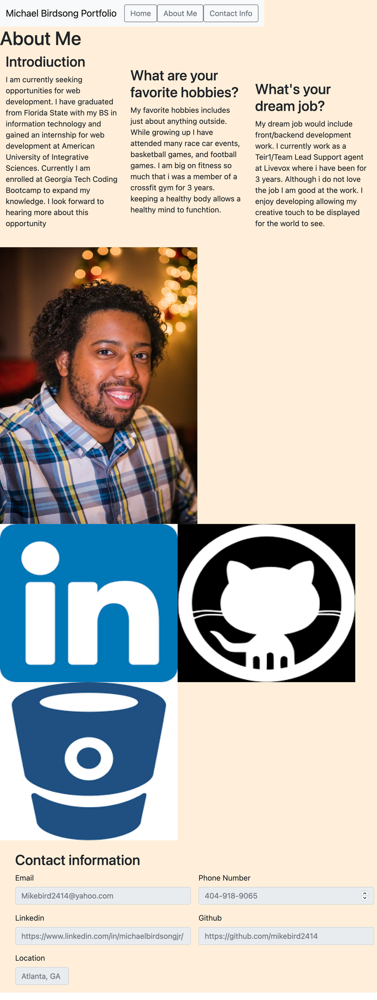
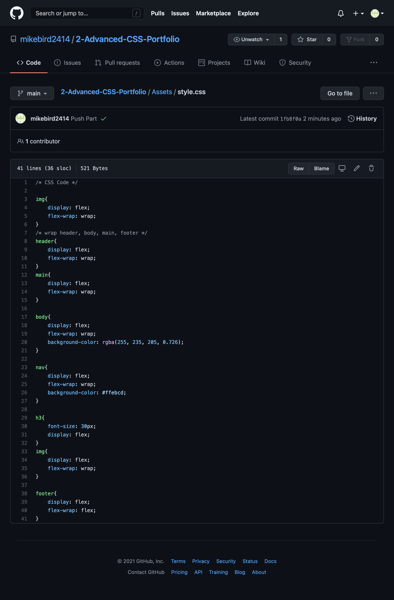
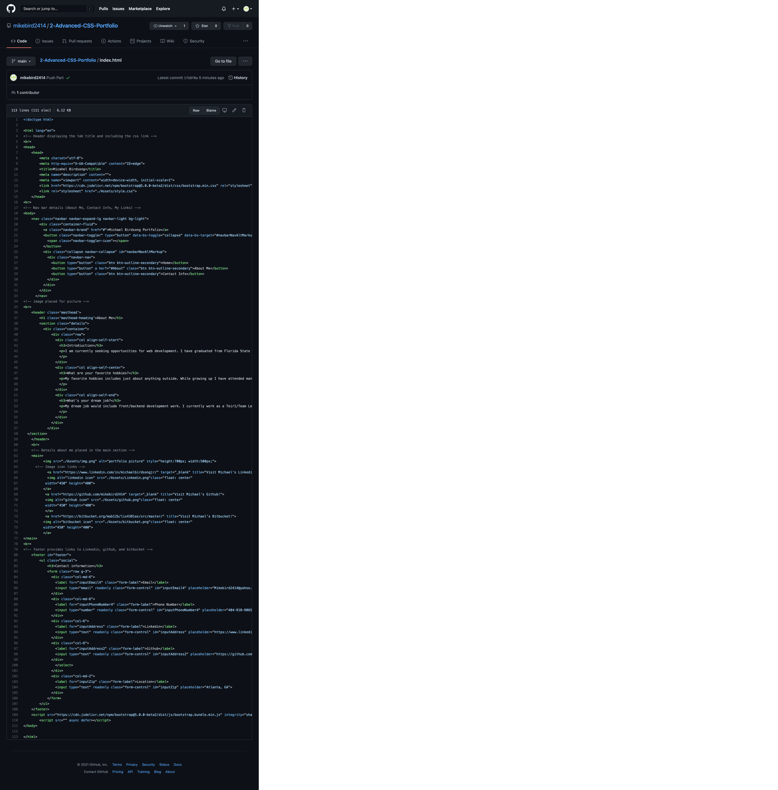

# 02 Advanced CSS: Portfolio

This week a protfolio was created from scratch to showcase where we are at the begginig of the course. Over the weeks as we learn more we will be alb to come back to the code to improve on our personal page displaying our hard work. This task I was able to create a functional portfolio page giving insight to a little bit about my background such as intrest, hobbies, and work/education experience. 

# Links:
Git Resository Link: https://github.com/mikebird2414/2-Advanced-CSS-Portfolio

Link to Michael's Portfolio: https://mikebird2414.github.io/2-Advanced-CSS-Portfolio/


## Acceptance Criteria

Here are the critical requirements necessary to develop a portfolio that satisfies a typical hiring manager’s needs:

```
GIVEN I need to sample a potential employee's previous work
WHEN I load their portfolio
THEN I am presented with the developer's name, a recent photo, and links to sections about them, their work, and how to contact them
WHEN I click one of the links in the navigation
THEN the UI scrolls to the corresponding section
WHEN I click on the link to the section about their work
THEN the UI scrolls to a section with titled images of the developer's applications
WHEN I am presented with the developer's first application
THEN that application's image should be larger in size than the others
WHEN I click on the images of the applications
THEN I am taken to that deployed application
WHEN I resize the page or view the site on various screens and devices
THEN I am presented with a responsive layout that adapts to my viewport
```


## Screenshot Results

The following animation shows the web application's appearance and functionality:






